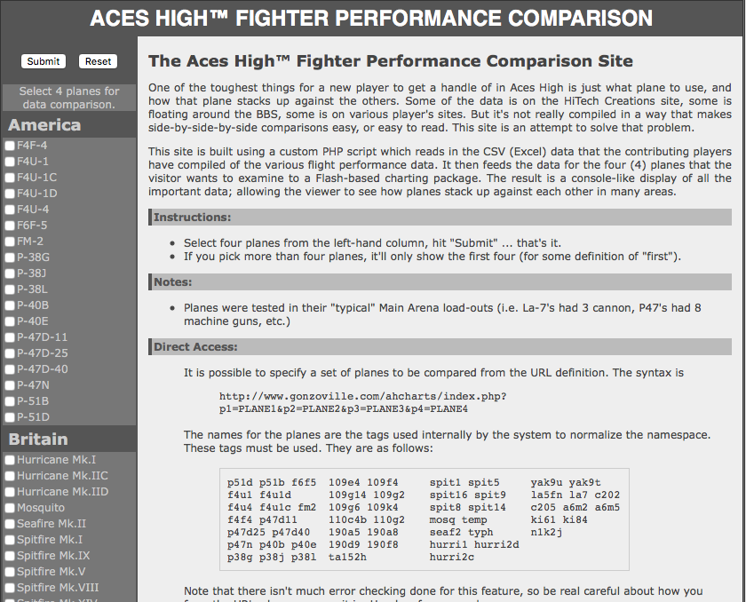

# AHCharts

This is a project I put together way back in 2011. It uses Flash-based charting to plot the performance characteristics of the aircraft in the game Aces High II.

_This is free to copy and re-use as long as a link-back to this repository is included._

## Installation

Load the folder "ahcharts" onto the web server, point your browser to the index.php file there, done.

## Caveat Emptor

- This was written a long, long time ago.
- The data is no longer current.
- None of the aircraft added since 2011 are included.
- The Flash component may not work with the current Flash player. 